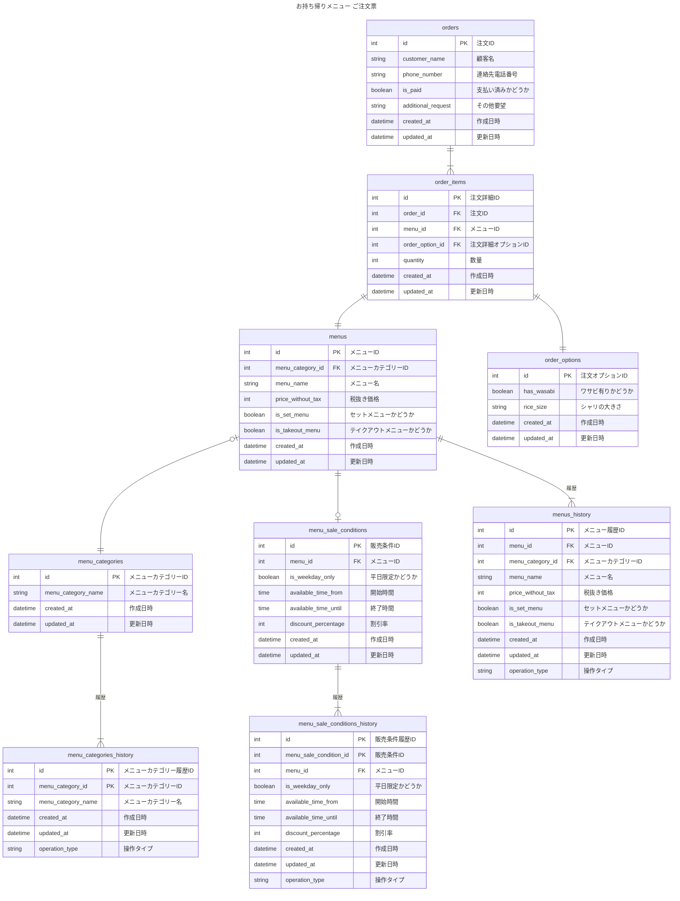

# 課題
「データベースモデリング1」の課題2

# 目的
下記の要件が追加された場合のテーブル設計のレビューをお願いしたい
1. シャリの大小を選択できる（課題2-1）
2. セット商品とは別に、寿司ネタが毎月何個売れているのか知る必要が生じた場合（課題2-2）
3. 平日の16時まで限定で注文可能なセットメニューが追加される（課題2-3）
4. お好みすしの中で、「白身」「赤身」「軍艦」「巻物」のカテゴリー分けで表示ができる（課題2-3）
5. お好み寿司のみ18:00以降10%オフ（課題2-3）

# 内容

# 考えたこと
## 要件1
- 注文オプションテーブルを追加
## 要件2
- 設計の変更はなし
    - 既存の設計でも、SQLで集計することが可能なため
- 人気の寿司ネタを特定したい場合、寿司ネタ名でGROUP BYされることが多い可能性があるので、寿司ネタ名（menu_name）にインデックスを貼ることを検討しても良いかもしれない
## 要件3
- 販売条件テーブルを追加
## 要件4
- 設計の変更はなし
    - 既存の設計で考慮されているため
## 要件5
- 販売条件テーブルを追加

# 確認・相談
- 要件3・5について、アプリケーション側で実装すべきか？DB設計に組み込むべきか？