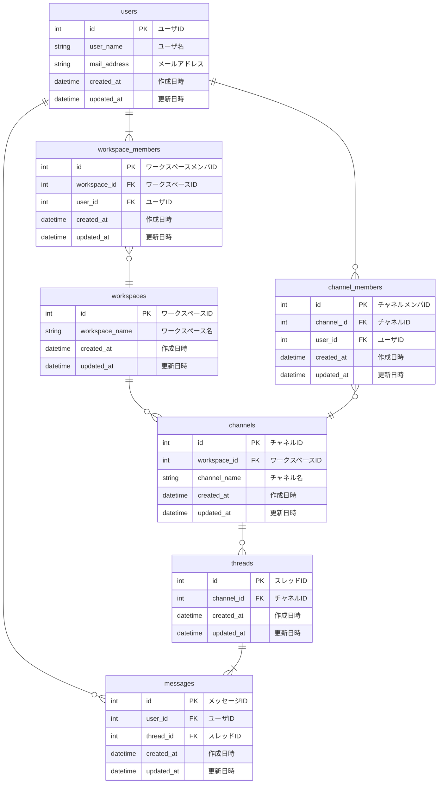

# 課題
データベースモデリング2

# 目的
以下のレビューをお願いしたい
- エンティティの抽出
- ER図

# 仕様（課題より抜粋）
- メッセージ
    - 誰が、どのチャネルに、いつ、どんな内容を投稿したのか分かること
- スレッドメッセージ
    - 誰が、どのメッセージに、いつ、どんな内容をスレッドとして投稿したのか分かること
- チャネル
    - そのチャネルに所属しているユーザにしか、メッセージ・スレッドメッセージが見えないこと
- ユーザ
    - ワークスペースに参加・脱退できること
    - チャネルに参加・脱退できること
- 横断機能
    - メッセージとスレッドメッセージを横断的に検索できること（例えば「hoge」と検索したら、この文字列を含むメッセージとスレッドメッセージを両方とも取得できること）
    - 参加していないチャネルのメッセージ・スレッドメッセージは検索できないこと

# 結論
## エンティティの抽出
- ユーザ
- ワークスペース
- チャネル
- スレッド
- メッセージ

## ER図

# 考えたこと
- 何らかのワークスペースに参加するときにユーザ登録することを想定しています
- スレッドが必ずメッセージをもつべきかどうか悩みました
    - テーブルのシンプルさと検索時のクエリが短くなることを考えて、必ずメッセージをもつ形で設計しました
    - デメリットとしては、スレッドのレコード数が大きくなってしまうことがありそうです
- 要件にはないですが、アーカイブデータを保つとしたら、下記のテーブルを用意する形かなと考えました
    - users
        - メッセージで削除されたユーザの名称も重要なため
    - channels
    - channel_members
    - threads
    - messages

# メンバーに確認・相談したい内容
- スレッドが必ずメッセージをもつべきかどうか