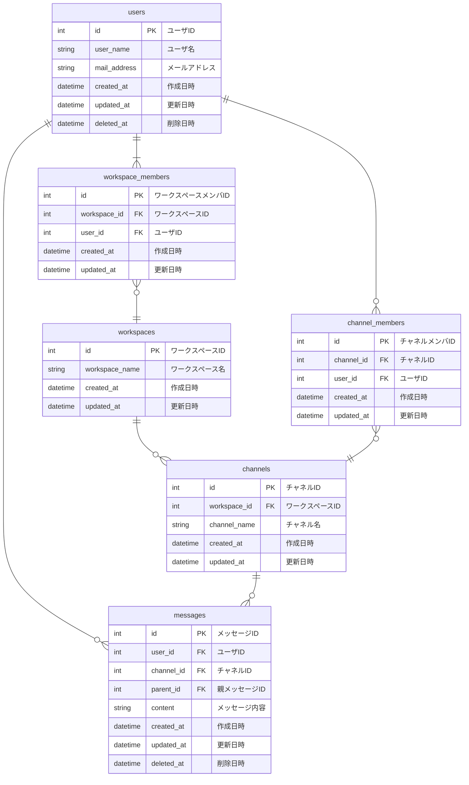

# 課題
データベースモデリング2

# 目的
以下のレビューをお願いしたい
- DDL
- DML

# 仕様（課題より抜粋）
- メッセージ
    - 誰が、どのチャネルに、いつ、どんな内容を投稿したのか分かること
- スレッドメッセージ
    - 誰が、どのメッセージに、いつ、どんな内容をスレッドとして投稿したのか分かること
- チャネル
    - そのチャネルに所属しているユーザにしか、メッセージ・スレッドメッセージが見えないこと
- ユーザ
    - ワークスペースに参加・脱退できること
    - チャネルに参加・脱退できること
- 横断機能
    - メッセージとスレッドメッセージを横断的に検索できること（例えば「hoge」と検索したら、この文字列を含むメッセージとスレッドメッセージを両方とも取得できること）
    - 参加していないチャネルのメッセージ・スレッドメッセージは検索できないこと

# 結論
## エンティティの抽出
- ユーザ
- ワークスペース
- チャネル
- メッセージ

## ER図


# 環境構築方法
## 前提条件
- Dockerおよびmakeがインストールされていること

## 手順
1. MySQLコンテナの起動および接続
    ```sh
    make setup
    ```
2. MySQLコンテナの削除
    ```sh
    make stop
    ```
    イメージやボリュームも削除したい場合
    ```sh
    make destroy
    ```

# 考えたこと
## 削除処理
- 下記を踏まえて、usersテーブルとmessagesテーブルのみdeleted_atカラムを用意する
    - 基本的には物理削除で問題なさそう
    - ワークスペースから削除されたユーザ名も表示できるようにしたい
    - 親メッセージ削除時に子メッセージも自動で削除しないので、親メッセージの物理削除はしない
## インデックス設計
- MySQLでは、外部キーを持つカラムには自動でインデックスが作成されるので、明示的には設定しないようにした
- 複合インデックスを追加で設定した
    - 特定のチャンネルのメッセージを表示する際、作成日時でソートすることを想定
## 検索機能
- MySQLの標準機能を試してみたかったので、MeCabパーサを導入して日本語全文検索ができるようにした

# メンバーに確認・相談したい内容
- 今回のようなアプリケーションで他に有効そうな複合インデックス
    - アプリケーションを実装していく中で必要だと感じたものに追加していくくらいしか思いつきませんでした