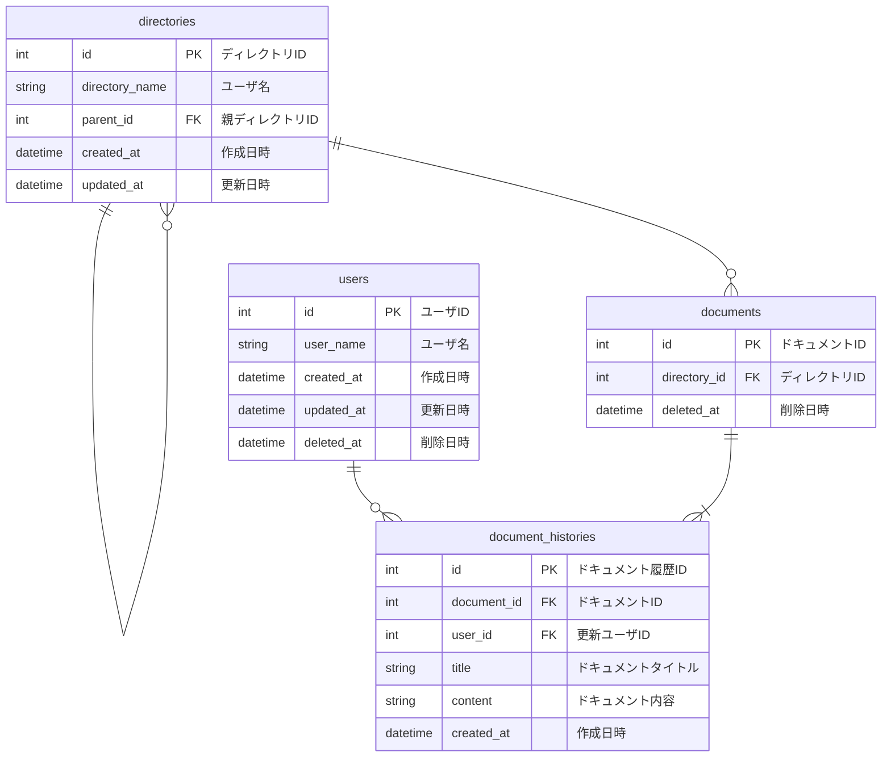

```mermaid
erDiagram
    users ||--o{ document_histories : ""
    directories ||--o{ directories : ""
    directories ||--o{ documents : ""
    documents ||--|{ document_histories : ""

    users {
        int id PK "ユーザID"
        string user_name "ユーザ名"
        datetime created_at "作成日時"
        datetime updated_at "更新日時"
        datetime deleted_at "削除日時"
    }

    directories {
        int id PK "ディレクトリID"
        string directory_name "ユーザ名"
        int parent_id FK "親ディレクトリID"
        datetime created_at "作成日時"
        datetime updated_at "更新日時"
    }

    documents {
        int id PK "ドキュメントID"
        int directory_id FK "ディレクトリID"
        datetime deleted_at "削除日時"
    }

    document_histories {
        int id PK "ドキュメント履歴ID"
        int document_id FK "ドキュメントID"
        int user_id FK "更新ユーザID"
        string title "ドキュメントタイトル"
        string content "ドキュメント内容"
        datetime created_at "作成日時"
    }
```