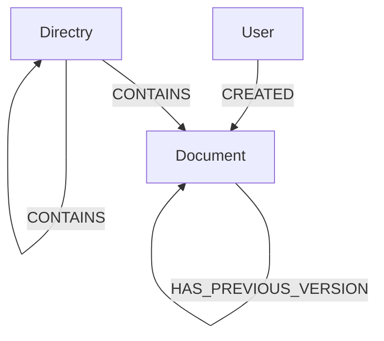
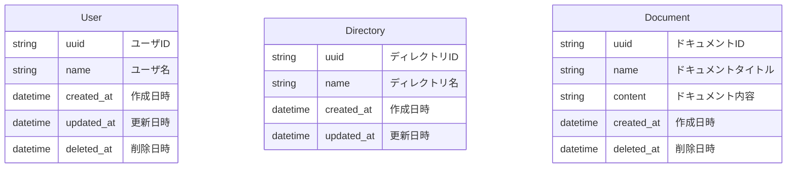

リレーション

```mermaid
graph TD
  User --CREATED--> Document
  Directry --CONTAINS--> Directry
  Directry --CONTAINS--> Document
  Document --HAS_PREVIOUS_VERSION--> Document
```
ラベル・プロパティ

```mermaid
erDiagram
    User {
        string uuid "ユーザID"
        string name "ユーザ名"
        datetime created_at "作成日時"
        datetime updated_at "更新日時"
        datetime deleted_at "削除日時"
    }

    Directory {
        string uuid "ディレクトリID"
        string name "ディレクトリ名"
        datetime created_at "作成日時"
        datetime updated_at "更新日時"
    }

    Document {
        string uuid "ドキュメントID"
        string name "ドキュメントタイトル"
        string content "ドキュメント内容"
        datetime created_at "作成日時"
        datetime deleted_at "削除日時"
    }
```