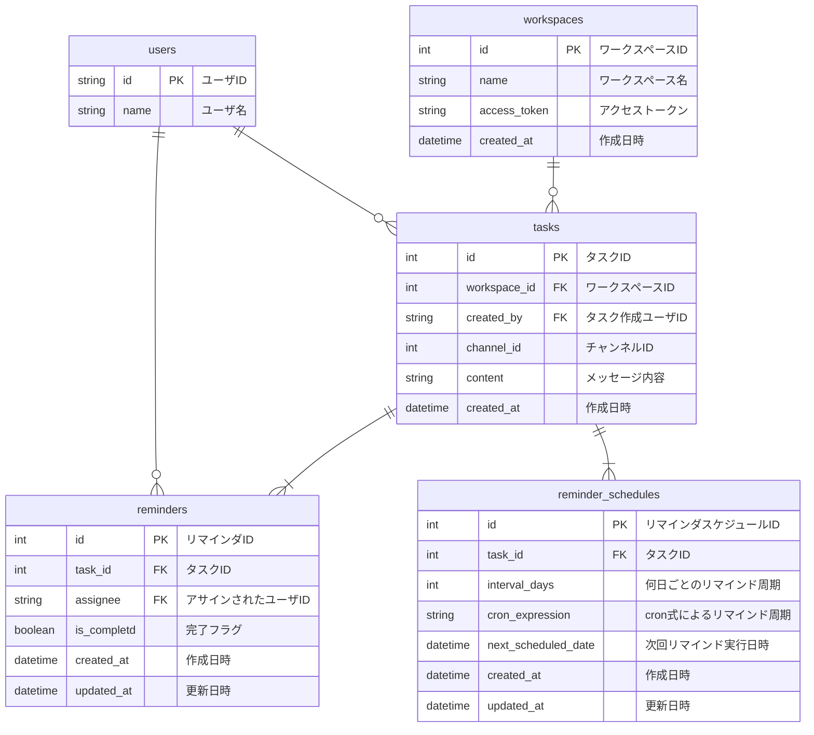

# 課題
データベースモデリング4

# 目的
以下のレビューをお願いしたい
- DDL
- DML

# 仕様（課題より抜粋）
- リマインダー
    - Slackに登録している他のユーザ（複数可）宛にリマインダーを設定できる
    - リマインダーには送信相手、文面、頻度を指定可能
    - 1時間ごとにバッチが動き、配信が必要なリマインダーを指定されたSlackユーザに配信する
- リマインダーの周期
    - 設定可能な周期は、現時点では以下の4種類（もしかすると今後増えるかもしれませんが、未定です！）
        - 毎日
        - X日おき
        - 毎週X曜日
        - 毎月X日

# 結論
## エンティティの抽出
- ユーザ
- ワークスペース
- タスク
- リマインダ
- リマインダ周期

## ER図


# 環境構築方法
## 前提条件
- Dockerおよびmakeがインストールされていること

## 手順
1. MySQLコンテナの起動および接続
    ```sh
    make setup
    ```
2. MySQLコンテナの削除
    ```sh
    make stop
    ```
    イメージやボリュームも削除したい場合
    ```sh
    make destroy
    ```

# 仮定
Slack APIについてよく理解できていないので誤りがあるかもしれないが、ひとまず下記の条件のもと検討した
- Slack APIから取得できるユーザIDが全ワークスペースでユニークと仮定
- リソースサーバへのリクエストで使用するアクセストークンは同一ワークスペースで共通

# 考えたこと
- アクセストークンはアプリケーション側で暗号化することを想定した
    - 下記を参考に、DB側で暗号化するよりも若干安全性が高いと判断したため
        https://www.youtube.com/watch?v=CLs-jcfRVRQ
- リマインド周期については、拡張性を考慮してcron式で保存できるようにしたが、要件にある「X日おき」が表現できないので、そのためのカラムも用意した。アプリケーション側で独自に拡張できるのであれば、そのほうが良いかもしれない
