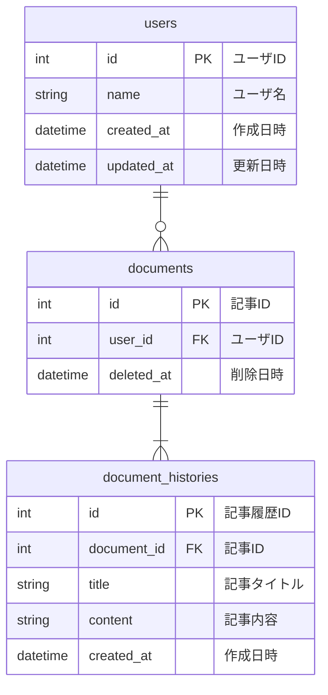

# 課題
データベースモデリング5 課題1

# 目的
- 論理・物理設計のレビューをお願いしたいです

# 仕様（課題より抜粋）
以下の機能を備えている、記事とその編集履歴を保存できるサービス（ブログサービスのようなもの）
- 記事
    - 1000文字程度の本文を記入して保存できる
- 記事の履歴
    - 記事を更新すると履歴が保存される
    - 特定の記事の履歴を一覧表示できる
    - 履歴を選択して過去の記事状態に戻す事が可能
- 記事の閲覧
    - 最新状態の記事を一覧表示できる

# 結論
## エンティティの抽出
- ユーザ
- 記事

## ER図


# 考えたこと
- DBモデリング3と同様の方法を採用

# 環境構築方法
## 前提条件
- Dockerおよびmakeがインストールされていること

## 手順
1. MySQLコンテナの起動および接続
    ```sh
    make start
    ```
2. MySQLコンテナの削除
    ```sh
    make stop
    ```
    イメージやボリュームも削除したい場合
    ```sh
    make destroy
    ```
